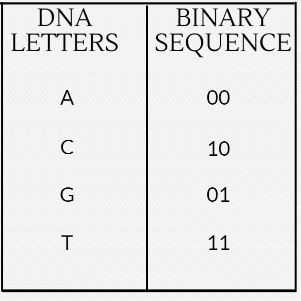

* [DCode](https://www.dcode.fr)

	Support many crypto algorithms, but also some interesting tools.

* [CyberChef](https://gchq.github.io/CyberChef/)

	Online tool to encrypt/decrypt, encode/decode, analyse, and perform many other operations on data.


* [Keyboard Shift](https://www.dcode.fr/keyboard-shift-cipher)

	ROT but using the keyboard layout.

* Bit Shift

	Characters can be shifted by a fixed number of bits.


* DNA Codes

    A DNA sequence can be used to encode a message.

    
    

* XOR

	Simple logic operation that can be used to encrypt a message with a key.

	Encryption: c = m ^ k
	Decryption: m = c ^ k

* [Caesar Cipher](https://www.dcode.fr/caesar-cipher)

	Shift cipher using the alphabet. Different alphabets can also be used. Vulnerable to frequency analysis.


* [Atbash Cipher](https://en.wikipedia.org/wiki/Atbash) 
	
	Shift cipher using the alphabet in reverse order. Vulnerable to frequency analysis.

* [Vigenere Cipher](https://en.wikipedia.org/wiki/Vigen%C3%A8re_cipher) 
	
	Shift cipher using a key. The key is repeated to match the length of the message.

	| Type    | Content     |
    |---------|-------------|
	| Message | HELLO WORLD |
	| Key     | ABCDE FABCD |
	| Cipher (sum)%26  | HFNLP XQEMK |


* [Gronsfeld Cipher](http://rumkin.com/tools/cipher/gronsfeld.php)

	Variant of the Vigenere cipher using a key of numbers instead of letters.

* [Beaufourt Cipher](https://www.dcode.fr/beaufort-cipher)


* [Bacon Cipher](https://en.wikipedia.org/wiki/Bacon%27s_cipher)

	A substitution cipher that replaces each character with five characters from a set of two (A and B is used most of the time). If we look at A as 0 and B as 1 it is a special encoding to binary numbers, where the character A has the value of binary `b00000`. Easy to recognize, because the ciphertext only contains two characters (e.g.: A and B) and the length of the ciphertext is divisible by 5. Example: `AAABB AAABA ABBAB AAABB AABAA AAAAB AAAAA AAABA ABBAB ABBAA`.

        [Online tool](http://rumkin.com/tools/cipher/baconian.php)

* Python random module cracker/predictor

	[https://github.com/tna0y/Python-random-module-cracker](https://github.com/tna0y/Python-random-module-cracker)... helps attack the Mersenne Twister used in Python's random module.

* Transposition Cipher


* [LC4](https://www.schneier.com/blog/archives/2018/05/lc4_another_pen.html) 
	This is an adaptation of RC4... just not. There is an implementation available in Python.
	[https://github.com/dstein64/LC4/blob/master/documentation.md](https://github.com/dstein64/LC4/blob/master/documentation.md)

* Elgamal

* Affine Cipher

* Substitution Cipher (use quip quip!)

	[https://quipqiup.com/](https://quipqiup.com/)

* Railfence Cipher

	[http://rumkin.com/tools/cipher/railfence.php](http://rumkin.com/tools/cipher/railfence.php)


* [Playfair Cipher](https://en.wikipedia.org/wiki/Playfair_cipher) 
	racker: [http://bionsgadgets.appspot.com/ww_forms/playfair_ph_web_worker3.html](http://bionsgadgets.appspot.com/ww_forms/playfair_ph_web_worker3.html)

* Polybius Square

	[https://www.braingle.com/brainteasers/codes/polybius.php](https://www.braingle.com/brainteasers/codes/polybius.php)

* The Engima

	[http://enigma.louisedade.co.uk/enigma.html](http://enigma.louisedade.co.uk/enigma.html),
	[https://www.dcode.fr/enigma-machine-cipher](https://www.dcode.fr/enigma-machine-cipher)


* Two-Time Pad

* [International Code of Signals Maritime](https://en.wikipedia.org/wiki/International_Code_of_Signals) 
	First drafted by the British Board of Trade in 1855 and adopted as a world-wide standard on 1 January 1901. It is used for communications with ships, but also occasionally used by geocaching mystery caches (puzzle caches), CTFs and various logic puzzles. You may want to give a look at the tool [maritime flags translator].


* Daggers Cipher

The daggers cipher is another silly text-to-image encoder. This is the key, and you can
find a decoder on [https://www.dcode.fr/daggers-alphabet](https://www.dcode.fr/daggers-alphabet).


* Hylian Language (Twilight Princess)

The Hylian language is another silly text-to-image encoder. This is the key, and you can
find a decoder on [https://www.dcode.fr/hylian-language-twilight-princess](https://www.dcode.fr/hylian-language-twilight-princess).


* Hylian Language (Breath of the Wild)

The Hylian language is another silly text-to-image encoder. This is the key, and you can
find a decoder on [https://www.dcode.fr/hylian-language-breath-of-the-wild](https://www.dcode.fr/hylian-language-breath-of-the-wild).


* Sheikah Language (Breathe of the Wild)

The Sheikah language is another silly text-to-image encoder. This is the key, and you can
find a decoder on [https://www.dcode.fr/sheikah-language](https://www.dcode.fr/sheikah-language).


* Hexahue Alphabet 

The hexhue is an another tex-to-image enocder. you can find a decoder
on [https://www.boxentriq.com/code-breaking/hexahue](https://www.boxentriq.com/code-breaking/hexahue)


* References to DICE, or EFF

	If your challenges references "EFF" or includes dice in some way, or showcases numbers 1-6 of length 5, try [https://www.eff.org/dice](https://www.eff.org/dice). This could refer to a passphrase generated by dice rolls available here: [https://www.eff.org/files/2016/07/18/eff_large_wordlist.txt](https://www.eff.org/files/2016/07/18/eff_large_wordlist.txt)

* [Base64], [Base32], [Base85], [Base91](https://www.dcode.fr/base-91-encoding) 
```
Base64:
TWFuIGlzIGRpc3Rpbmd1aXNoZWQsIG5vdCBvbmx5IGJ5IGhpcyByZWFzb24sIGJ1dCBieSB0aGlz
IHNpbmd1bGFyIHBhc3Npb24gZnJvbSBvdGhlciBhbmltYWxzLCB3aGljaCBpcyBhIGx1c3Qgb2Yg
dGhlIG1pbmQsIHRoYXQgYnkgYSBwZXJzZXZlcmFuY2Ugb2YgZGVsaWdodCBpbiB0aGUgY29udGlu
dWVkIGFuZCBpbmRlZmF0aWdhYmxlIGdlbmVyYXRpb24gb2Yga25vd2xlZGdlLCBleGNlZWRzIHRo
ZSBzaG9ydCB2ZWhlbWVuY2Ugb2YgYW55IGNhcm5hbCBwbGVhc3VyZS4=
```

```
Base32
ORUGS4ZANFZSAYLOEBSXQYLNOBWGKIDPMYQGEYLTMUZTELRANF2CA2LTEB3GS43JMJWGKIDCPEQGY33UOMQG6ZRAMNQXA2LUMFWCA3DFOR2GK4TTEBQW4ZBANVXXEZJAMVYXKYLMOMQHG2LHNZZSAZTPOIQHAYLEMRUW4ZZMEBSXQ5DSME======
```

```
Base85:
<~9jqo^BlbD-BleB1DJ+*+F(f,q/0JhKF<GL>Cj@.4Gp$d7F!,L7@<6@)/0JDEF<G%<+EV:2F!,
O<DJ+*.@<*K0@<6L(Df-\0Ec5e;DffZ(EZee.Bl.9pF"AGXBPCsi+DGm>@3BB/F*&OCAfu2/AKY
i(DIb:@FD,*)+C]U=@3BN#EcYf8ATD3s@q?d$AftVqCh[NqF<G:8+EV:.+Cf>-FD5W8ARlolDIa
l(DId<j@<?3r@:F%a+D58'ATD4$Bl@l3De:,-DJs`8ARoFb/0JMK@qB4^F!,R<AKZ&-DfTqBG%G
>uD.RTpAKYo'+CT/5+Cei#DII?(E,9)oF*2M7/c~>
```

```
Base91:
8D$J`/wC4!c.hQ;mT8,<p/&Y/H@$]xlL3oDg<W.0$FW6GFMo_D8=8=}AMf][|LfVd/<P1o/1Z2(.I+LR6tQQ0o1a/2/WtN3$3t[x&k)zgZ5=p;LRe.{B[pqa(I.WRT%yxtB92oZB,2,Wzv;Rr#N.cju"JFXiZBMf<WMC&$@+e95p)z01_*UCxT0t88Km=UQJ;WH[#F]4pE>i3o(g7=$e7R2u>xjLxoefB.6Yy#~uex8jEU_1e,MIr%!&=EHnLBn2h>M+;Rl3qxcL5)Wfc,HT$F]4pEsofrFK;W&eh#=#},|iKB,2,W]@fVlx,a<m;i=CY<=Hb%}+},F
```


* [Base65535](https://github.com/qntm/base65536)


	Unicode characters encoding. Includes a lot of seemingly random spaces and chinese characters!

```
𤇃𢊻𤄻嶜𤄋𤇁𡊻𤄛𤆬𠲻𤆻𠆜𢮻𤆻ꊌ𢪻𤆻邌𤆻𤊻𤅋𤲥𣾻𤄋𥆸𣊻𤅛ꊌ𤆻𤆱炼綻𤋅𤅴薹𣪻𣊻𣽻𤇆𤚢𣺻赈𤇣綹𤻈𤇣𤾺𤇃悺𢦻𤂻𤅠㢹𣾻𤄛𤆓𤦹𤊻𤄰炜傼𤞻𢊻𣲻𣺻ꉌ邹𡊻𣹫𤅋𤇅𣾻𤇄𓎜𠚻𤊻𢊻𤉛𤅫𤂑𤃃𡉌𤵛𣹛𤁐𢉋𡉻𡡫𤇠𠞗𤇡𡊄𡒌𣼻燉𣼋𦄘炸邹㢸𠞻𠦻𡊻𣈻𡈻𣈛𡈛ꊺ𠆼𤂅𣻆𣫃𤮺𤊻𡉋㽻𣺬𣈛𡈋𤭻𤂲𣈻𤭻𤊼𢈛儛𡈛ᔺ
```

* [Base41](https://github.com/sveljko/base41/blob/master/python/base41.py)

* "Unflattening" Base64 in lowercase or uppercase

	Some time ago we needed to recover the original Base64 string from one that is in all lowercase or all uppercase. Caleb wrote a good script to smartly do this: [https://pastebin.com/HprZcHrY](https://pastebin.com/HprZcHrY)
